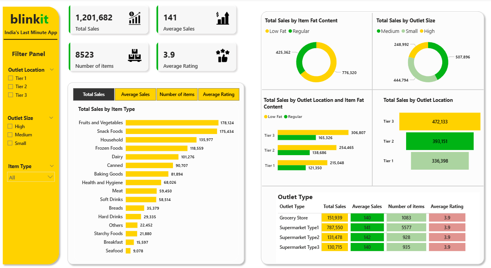

# Blinkit Sales Analysis Dashboard

## 🧠 Problem Statement
Blinkit wants to understand its product performance, outlet sales, and location-based trends to make better inventory and marketing decisions.

## 📊 Tools Used
- Power BI
- Excel

## 🧾 Dataset
- 8,523 product records
- ₹1.2M total sales value

## 💡 Insights
- Tier 3 locations and medium-sized outlets generated the highest revenue.
- Top-selling categories: Fruits & Vegetables, Snack Foods.

## 📌 Dashboard
[Download Dashboard (PDF)](Blinkit Sales Project.pdf)

## 🖼️ Preview

